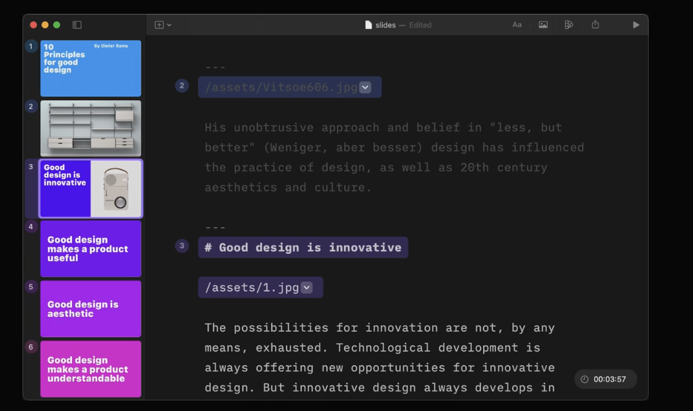

# Mobius
Build a Math focused presentation tool that lets users input and edit content with Markdown
and Latex, that content is then auto transofrmed into slide templates.
so far this is similar to AI PRESENTER. Now here we make iit Math focused by integrating
Animation functions like those of Manim. So it's like Manim + AI PRESENTER.
We won't use manim because it's a performance bottlneck, we want the app to run on Browser so we
use our built in animations with libraries like flubber etc...

